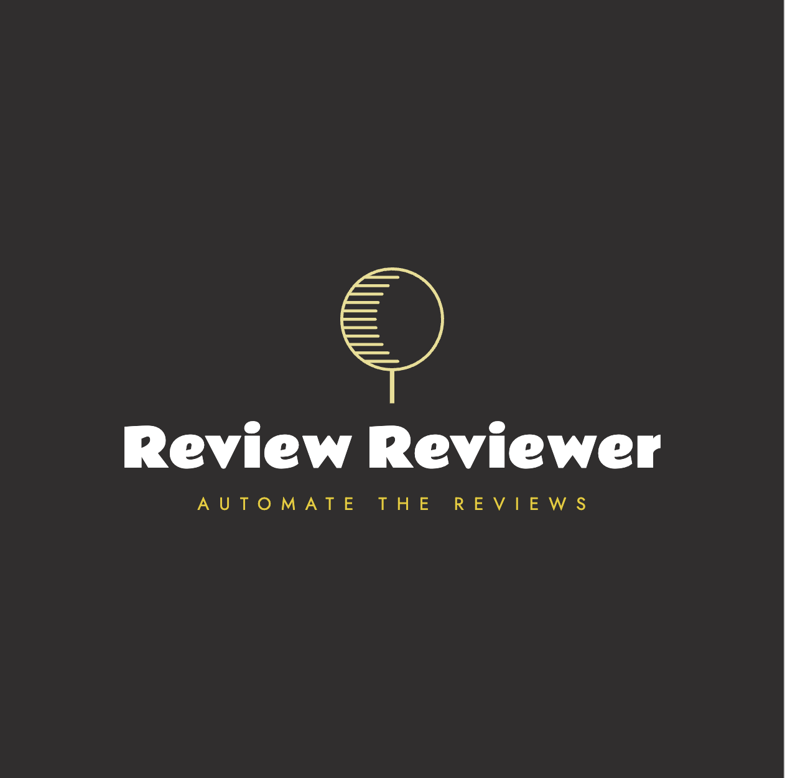

# TikTok TechJam 2025
Review Reviewer

Product of Team Null for TikTok TechJam 2025

1. The product is an AI-based comment reviewer. It helps applications like google map to filter out low-quality comments like advertisement and irrelavent comments.

Our product is an AI-based comment classifier. Our product will classify the given comments based on the text, image, rank and information about the place.
   - For users, our product will increase user experience by removing low-quality comments
   - For business owners, out product will help them to get more legitmate reviews and hence helping them to imporve their business better
   - For platforms, our product will help to reduce work require for comment review by enabling automation

2. Here are the main tools and APIs used to develop this product
   -  Python: The primary programming language for backend logic and AI integration.
   -  VSCode: The main ide used for the ease of programming.
   -  Jupyter Notebook: Used for prototyping and testing code interactively.
   -  Groq API: Provides access to large language models (Llama 3.1 8B in our case) for AI-based text classification.
   -  JSON: Used for structured data exchange between the AI model and the application.

3. Here are the libraries we used in this project
   - dotenv: This library is used to securely load environment variables (such as API keys) from a .env file, keeping sensitive information out of the codebase.
   - groq: The official Python client for interacting with the Groq API, which enables access to large language models for text classification tasks.
   - json: A standard Python library for parsing and generating JSON data.
